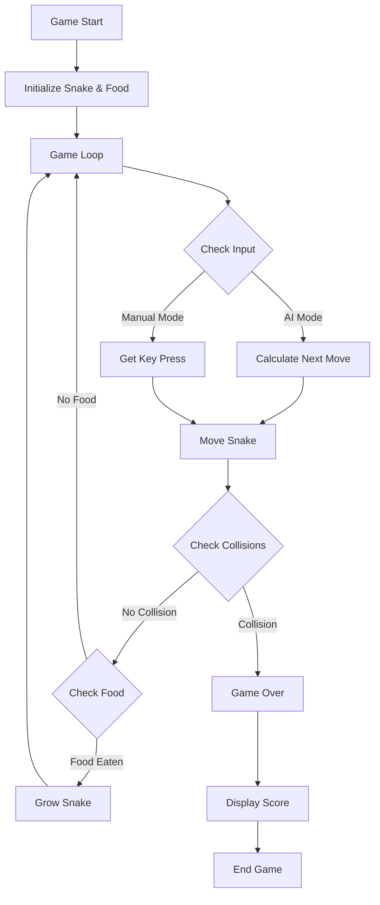

# Snake Game AI Project

## Overview
An intelligent Snake game implementation using Python and Pygame where an AI controls the snake to collect food while avoiding collisions.

## Game Flow


## Project Structure
```
snake_agent/
│
├── main.py          # Game loop and main logic
├── snake.py         # Snake class implementation
├── food.py          # Food class implementation
└── README.md        # This file
```

## Features
- 🤖 AI-controlled snake movement
- 🍎 Multiple food items
- 🎮 Manual control option (debug mode)
- 📊 Dynamic scoring system
- 🎯 Configurable grid size
- 🚧 Collision detection

## Technical Details

### Snake Class
The Snake class manages:
```python
class Snake:
    def __init__(self, size=20)
    def move()
    def grow()
    def change_direction(direction)
    def collision_with_self()
```

## Requirements
- Python 3.10+
- Pygame library
- NumPy library

## Installation

1. Clone the repository:
```sh
git clone https://github.com/yourusername/snake_agent.git
cd snake_agent
```

2. Install dependencies:
```sh
pip install pygame numpy
```

## Usage

Start the game:
```sh
python main.py [GRID_DIMENSION] [FOOD_COUNT]
```

### Parameters
- `GRID_DIMENSION`: Optional grid size (default: 20)
- `FOOD_COUNT`: Optional number of food items (default: 1)

### Controls
- **AI Mode**: Automatic snake movement
- **Debug Mode**:
  - ⬆️ Up Arrow: Move Up
  - ⬇️ Down Arrow: Move Down
  - ⬅️ Left Arrow: Move Left
  - ➡️ Right Arrow: Move Right
  - ❌ Window Close: Quit Game

## Configuration
Default settings in main.py:
- Window Size: 600x400 pixels
- Grid Size: 20x20 pixels
- Initial Snake Length: 3 units
- Starting Position: Center of screen

## Development
### Contributing
1. Fork the repository
2. Create feature branch (`git checkout -b feature/AmazingFeature`)
3. Commit changes (`git commit -m 'Add AmazingFeature'`)
4. Push to branch (`git push origin feature/AmazingFeature`)
5. Open Pull Request

### Testing
```sh
python -m pytest tests/
```

## License
MIT License

## Contact
Your Name - shyamsundar
Project Link:https://github.com/shyam20433

---
*Last Updated: October 8, 2025*
